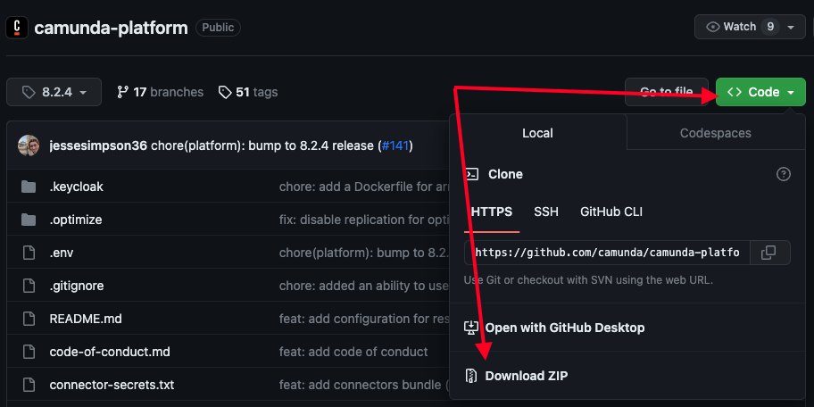
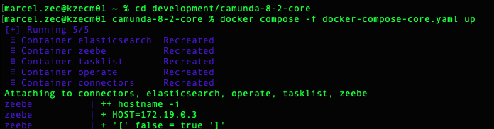
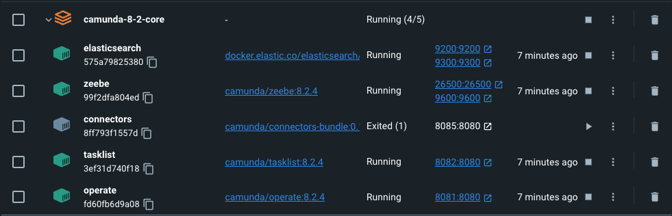
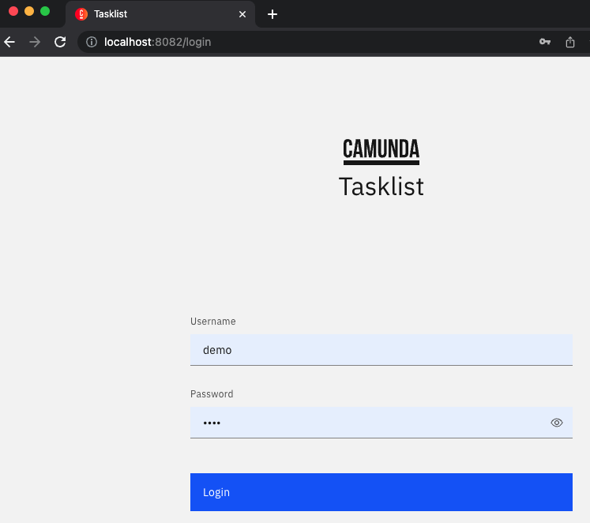
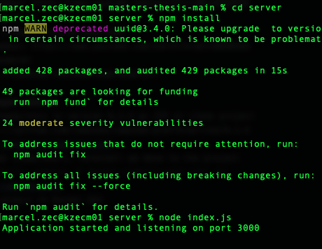
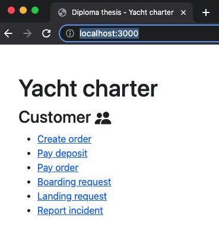

# Transformation of business processes into application processes
Master's thesis

#### Abstract
The diploma thesis focuses on the transformation of business processes into application processes using the workflow tool Camunda. The thesis introduces the reader to business management and describes the problems it has gone through. It describes the trends that help solve these problems. To accomplish the goals of the work, we first analyzed the MMABP methodology,  which is utilized for analyzing and modeling business processes.  Furthermore, we analyzed the methodological procedure for converting conceptual models into implementation-independent technological models. Additionally, we analyzed the Camunda workflow tool. 
The outcome of this research is a systematic approach to transforming business processes into application processes using the Camunda tool. This approach consists of two distinct procedures.  Firstly, an enhanced and refined methodological process is proposed for transforming conceptual models, developed through the utilization of the MMABP methodology, into technological models. Secondly, a methodical procedure is introduced for transforming technological models into implementation models specific to Camunda 8 platform.

## Project
- [camundaProject](https://github.com/marcel-zec/masters-thesis/tree/main/camundaProject) 
   - BPMN diagrams, forms, DMN diagrams
- [server](https://github.com/marcel-zec/masters-thesis/tree/main/server) 
   - NodeJS server, Zeebe client
 
## Start-up instructions
#### Prerequisites
- installed Docker 20.10.16+
   - download: https://docs.docker.com/get-docker/
   - tutorial for Windows: https://www.youtube.com/watch?v=cMyoSkQZ41E
- installed NodeJS v16.17.1+
   - download: https://nodejs.org/en/download
   - tutorial for Windows: https://www.youtube.com/watch?v=qXJc0DUBSbQ
- installed Camunda modeler
   - download: https://camunda.com/download/modeler/

#### Launch Self-managed Camunda
1. download Camunda repository in version 8.2.4 as ZIP or clone project
   -  download: https://github.com/camunda/camunda-platform/tree/8.2.4
   
2. in the command line (PowerShell, Terminal) we move to the project
3. run the command `docker compose -f docker-compose-core.yaml up`
   
4. check running containers in Docker GUI
   - Zeebe
   - Elasticsearch
   - Operate
   - Tasklist
   
5. check the interface functionality (user name `demo` and password `demo`)
   - Operate http://localhost:8081/ 
   - Tasklist http://localhost:8082/
   

#### Deploy diagrams
1. download this repository as ZIP or clone project 
2. open all diagrams from `camundaProject/bpmn` and `camundaProject/dmn` in Camunda Modeler
3. deploy all diagrams

#### Launch server
1. (download this repository as ZIP or clone project)
2. in the command line (PowerShell, Terminal) we move to project folder 
   - command: `cd server`
3. run the command `npm install`, that will install all dependencies
4. run the command `node index.js`, that will start server
   
5. check the interface functionality (http://localhost:3000/)

